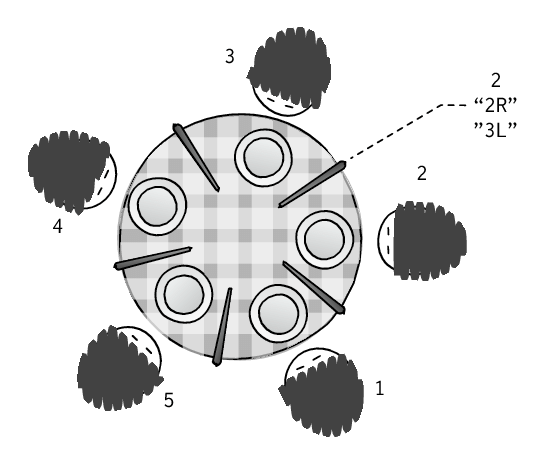

  

  
  
  

# Philosophers

This project is a solution to **The Dining Philosophers Problem** using mutex and semaphore programming techniques.

## Brief

The Dining Philosophers Problem states that K philosophers seated around a circular table with one chopstick between each pair of philosophers. There is one chopstick between each philosopher. A philosopher may eat if he can pick up the two chopsticks adjacent to him.

## Rules

- This project is to be coded in C, following the 42 Norm. Any leak, crash, undefined behavior or norm error means 0 to the project.

- A number of philosophers are sitting at a round table doing one of three things: eating, thinking or sleeping.

- While eating, they are not thinking or sleeping, while sleeping, they are not eating or thinking and of course, while thinking, they are not eating or sleeping.

- The philosophers sit at a circular table with a large bowl of spaghetti in the center.
- There are some forks on the table.

- As spaghetti is difficult to serve and eat with a single fork, it is assumed that a philosopher must eat with two forks, one for each hand.

- The philosophers must never be starving.

- Every philosopher needs to eat.

- Philosophers don’t speak with each other.

- Philosophers don’t know when another philosopher is about to die.

- Each time a philosopher has finished eating, he will drop his forks and start sleeping.

- When a philosopher is done sleeping, he will start thinking.

- The simulation stops when a philosopher dies.

- Each program should have the same options:
  - number_of_philosophers
  - time_to_die
  - time_to_eat
  - time_to_sleep
  - number_of_times_each_philosopher_must_eat (optional)

  - number_of_philosophers: is the number of philosophers and also the number of forks

  - time_to_die: is in milliseconds, if a philosopher doesn’t start eating ’time_to_die’ milliseconds after starting his last meal or the beginning of the simulation, it dies

  - time_to_eat: is in milliseconds and is the time it takes for a philosopher to eat. During that time he will need to keep the two forks.

  - time_to_sleep: is in milliseconds and is the time the philosopher will spend sleeping.

  - number_of_times_each_philosopher_must_eat: argument is optional, if all philosophers eat at least ’number_of_times_each_philosopher_must_eat’ the simulation will stop. If not specified, the simulation will stop only at the death of a philosopher.

- Each philosopher should be given a number from 1 to ’number_of_philosophers’.

- Philosopher number 1 is next to philosopher number ’number_of_philosophers’. Any other philosopher with number N is seated between philosopher N - 1 and philosopher N + 1

- Any change of status of a philosopher must be written as follows (with X replaced with the philosopher number and timestamp_in_ms the current timestamp in milliseconds)
  - timestamp_in_ms X has taken a fork
  - timestamp_in_ms X is sleeping
  - timestamp_in_ms X is thinking
  - timestamp_in_ms X died

- The status printed should not be scrambled or intertwined with another philosopher’s status.

- You can’t have more than 10 ms between the death of a philosopher and when it
will print its death.

- Again, philosophers should avoid to die!

### Allowed functions

The following are allowed for this project:

- [free](https://man7.org/linux/man-pages/man1/free.1.html)
- [gettimeofday](https://man7.org/linux/man-pages/man2/gettimeofday.2.html)
- [malloc](https://man7.org/linux/man-pages/man3/malloc.3.html)
- [memset](https://man7.org/linux/man-pages/man3/memset.3.html)
- [printf](https://man7.org/linux/man-pages/man3/printf.3.html)
- [pthread_create](https://man7.org/linux/man-pages/man3/pthread_create.3.html)
- [pthread_detach](https://man7.org/linux/man-pages/man3/pthread_detach.3.html)
- [pthread_join](https://man7.org/linux/man-pages/man3/pthread_join.3.html)
- [pthread_mutex_destroy](https://man7.org/linux/man-pages/man3/pthread_mutex_destroy.3p.html)
- [pthread_mutex_init](https://man7.org/linux/man-pages/man3/pthread_mutex_init.3p.html)
- [pthread_mutex_lock](https://man7.org/linux/man-pages/man3/pthread_mutex_lock.3p.html)
- [pthread_mutex_unlock](https://man7.org/linux/man-pages/man3/pthread_mutex_lock.3p.html)
- [usleep](https://man7.org/linux/man-pages/man3/usleep.3.html)
- [write](https://man7.org/linux/man-pages/man2/write.2.html)

## References

- [The Dining Philosophers problem](https://en.wikipedia.org/wiki/Dining_philosophers_problem)
- [Gazpachow's Philosophers solution](https://github.com/Gaspachow/philosophers-42)
- [Jacob Sorber - How to create and join threads in C (pthreads)](https://www.youtube.com/watch?v=uA8X5zNOGw8)
